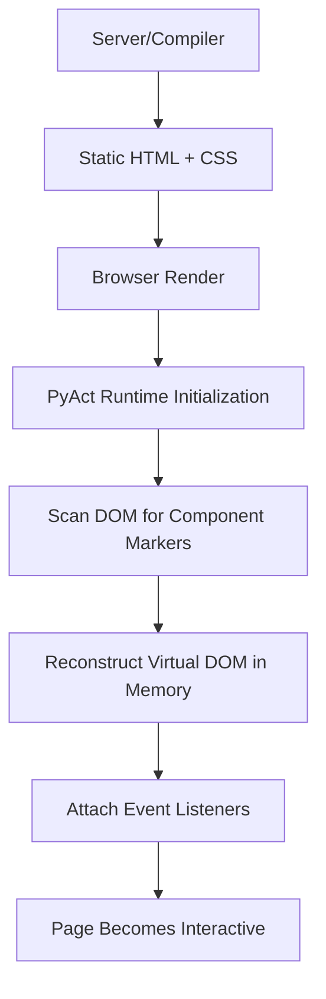

# PyAct Hydration Diagram

This document illustrates the hydration process in PyAct using Mermaid diagrams.

---

## Hydration Process

---

### Explanation

1. **Server/Compiler** generates HTML from `.pyx` code.
2. **Browser Render** paints the static content.
3. **PyAct Runtime** hydrates by building the Virtual DOM.
4. Event listeners are attached.
5. The app is fully interactive, and state-driven updates now work.
