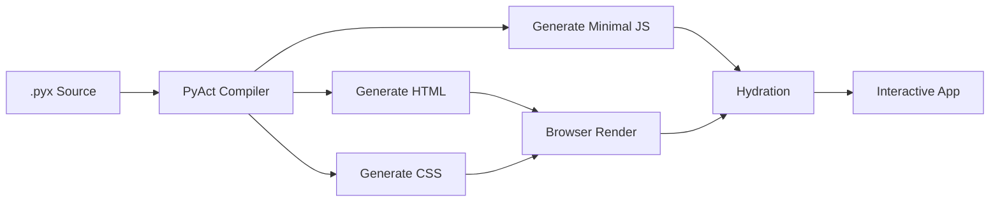
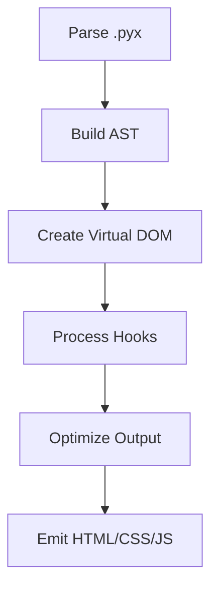
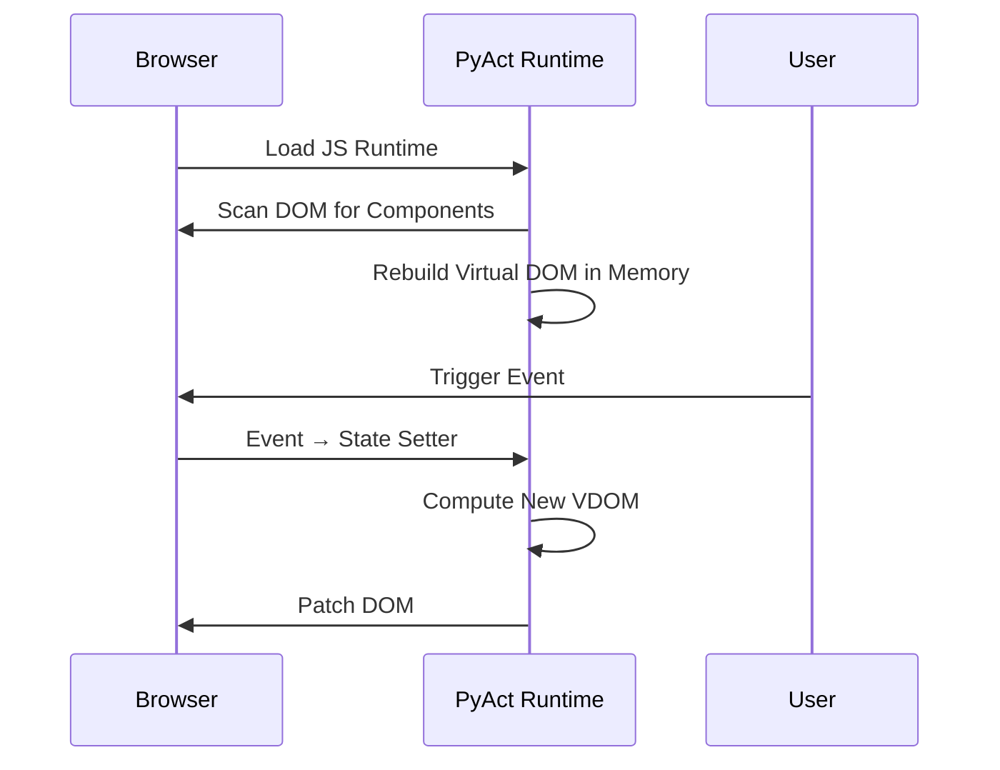

# PyAct Full Render + Hydration Pipeline

This document explains the full pipeline from `.pyx` source code to executable browser output, including hydration, events, and reactivity.

---

## 1. High-Level Flow

```
.pxy source code
       ↓
PyAct Compiler
       ↓
HTML + CSS + Minimal JS Output
       ↓
Browser Render
       ↓
Hydration (attach PyAct runtime)
       ↓
Interactive App
```

---

## 2. Compiler Responsibilities

* Parse `.pyx` syntax into an Abstract Syntax Tree (AST).
* Transform AST into a Virtual DOM definition.
* Process hooks (`use_state`, future hooks like `use_effect`).
* Generate optimized HTML structure.
* Generate CSS (component-scoped or global).
* Generate minimal JavaScript runtime used for event handling and state updates.

---

## 3. Generated Output

### HTML

* Static DOM representing the initial state of the UI.
* Component boundaries annotated with IDs.

### CSS

* Either inline styles or a separate stylesheet.
* Scoped styles per-component (optional).

### JavaScript

* Lightweight runtime (Pure DOM diff, event delegation, state store).
* Event handler bridge between browser events → PyAct state updates.

---

## 4. Browser Phase

### Step A — Rendering

* Browser receives HTML
* Styles are applied
* Initial layout and paint occurs

### Step B — Hydration

Hydration attaches interactive behavior to the static HTML.

* JS scans DOM for PyAct component markers
* Loads initial state embedded in the HTML
* Recreates Virtual DOM in memory
* Binds event listeners
* Synchronizes UI events with state changes

This makes the static HTML become a "living" PyAct application.

---

## 5. Reactivity Loop

```
User Event → JS Runtime → State Update → Re-render Virtual DOM → Diff → Patch DOM
```

### Detailed:

1. User clicks a button.
2. Event handler calls state setter.
3. State setter triggers a re-render of that component.
4. New Virtual DOM is created.
5. Diffing compares old vs new.
6. Only minimal DOM updates are applied.

This loop is small, focused, and efficient.

---

## 6. Planned Enhancements

* Server-side rendering (SSR) with hydration.
* Compiler-level static optimization.
* Zero-JS mode for static sites.
* Component-level caching.
* Optional Python runtime-in-browser (Pyodide) mode.

More will be added as PyAct evolves.

---

## 7. Mermaid Diagrams

### Pipeline Overview



### Compiler Internals



### Hydration & Reactivity


